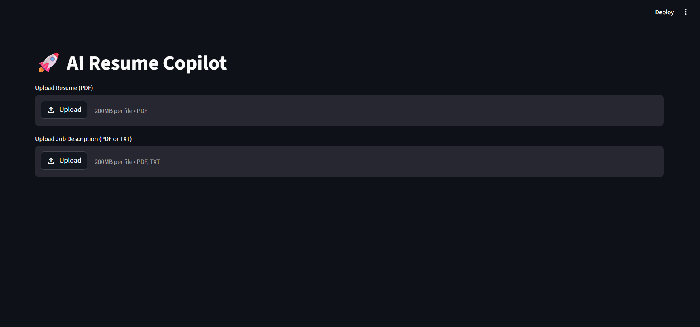
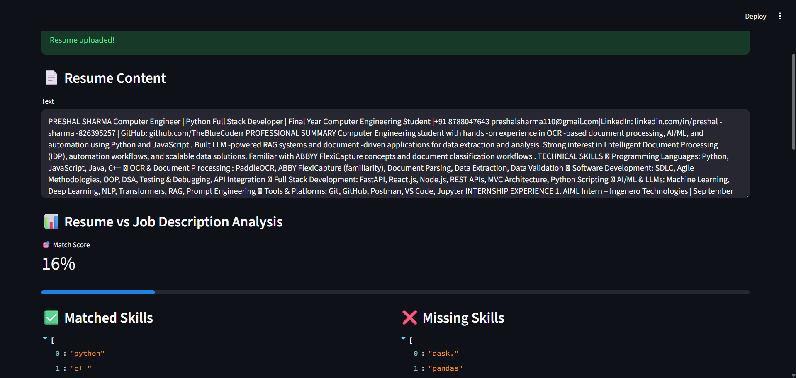
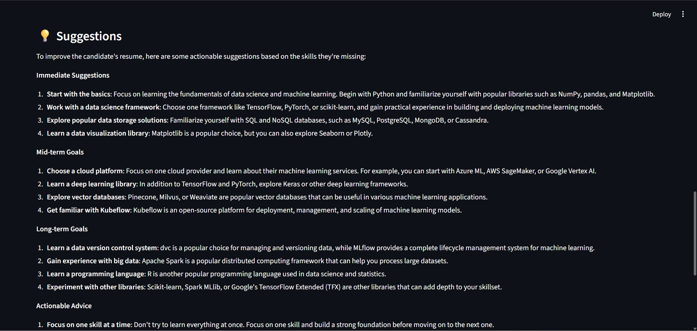
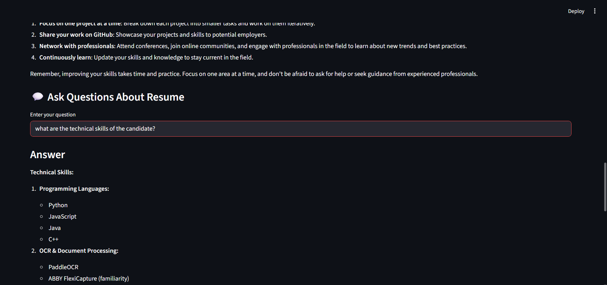

# AI Resume Copilot & Interview System (RAG + LLMs)

An end-to-end AI-powered system that analyzes resumes and job descriptions using Retrieval-Augmented Generation (RAG) and LLMs to provide intelligent insights, skill matching, and interactive Q&A.

# 🧠 Overview

This project is designed to simulate a real-world AI-powered recruitment assistant. It enables users to:

Upload a resume and job description
Analyze skill alignment
Identify missing skills
Get actionable suggestions
Ask questions about the resume using natural language

The system combines semantic search (FAISS) with LLM-based reasoning to deliver accurate and context-aware responses.

# ✨ Features
📄 Resume Understanding
Extracts and processes resume text from PDFs
Cleans and prepares data for analysis
🔍 Semantic Search (RAG)
Splits resume into chunks
Generates embeddings using Sentence Transformers
Retrieves relevant context using FAISS
🎯 Resume–Job Matching
Compares resume skills with job description
Calculates match score (0–100%)
Identifies matched vs missing skills
💡 AI Suggestions
Generates actionable improvements based on missing skills
Helps tailor resume for specific roles
💬 Interactive Q&A
Ask questions like:
“What are my technical skills?”
“List all my projects”
“What experience do I have in AI?”
Uses LLM + retrieved context for accurate answers
📊 Visual Insights
Match score visualization
Skill comparison charts
# 🏗️ Architecture
Resume / JD Upload
Text Extraction & Cleaning

        ↓
        
Chunking
        ↓
Embeddings (Sentence Transformers)
        ↓
FAISS Vector Store
        ↓
Query → Retrieval (Top-K Chunks)
        ↓
LLM (Groq API)
        ↓
Answer / Analysis
 # 🛠️ Tech Stack
Frontend: Streamlit
Backend: Python
LLM: Groq API (LLaMA 3.1)
Embeddings: Sentence Transformers (all-MiniLM-L6-v2)
Vector DB: FAISS
PDF Processing: PyPDF2
⚙️ Installation
# Clone the repo
git clone https://github.com/your-username/ai-resume-copilot.git
cd ai-resume-copilot

# Create virtual environment
python -m venv venv
venv\Scripts\activate  # Windows

## 📸 Screenshots

### Resume Upload

### Match Score

### Q&A System

# Install dependencies
pip install -r requirements.txt
🔑 Setup Environment Variables

Create a .env file in the root directory:

GROQ_API_KEY=your_api_key_here
▶️ Run the App
streamlit run app.py
📸 Screenshots (Add Yours)
Resume Upload UI
Match Score Visualization
Q&A Interface
Skill Comparison
🧪 Example Use Cases
Resume evaluation for job applications
Skill gap analysis
Interview preparation
AI-powered resume assistant
🚀 Future Improvements
Semantic skill matching (beyond exact keywords)
Resume parsing into structured JSON
Interview feedback scoring system
Multi-resume comparison
Deployment (Streamlit Cloud / Docker)
📌 Key Learnings
Implemented RAG pipeline from scratch
Built semantic search system using FAISS
Integrated LLMs for contextual reasoning
Designed a real-world AI product workflow
👨‍💻 Author

Preshal Sharma

GitHub: https://github.com/TheBlueCoderr
LinkedIn: https://linkedin.com/in/preshal-sharma-826395257
⭐ If you found this useful

Give this repo a ⭐ and feel free to contribute!
